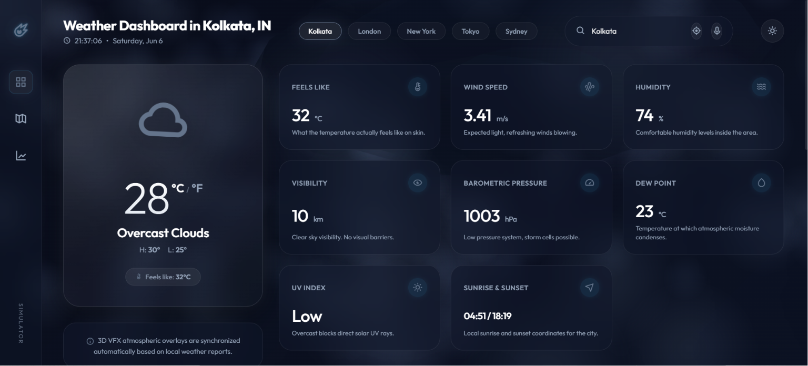

# 🌦️ NexGen Weather Dashboard

A modern, responsive, and visually immersive weather dashboard built with **Python**, **Flask**, **HTML5**, **CSS3**, and **JavaScript**. The application provides real-time weather information with a premium glassmorphism-inspired UI, animated effects, voice search capabilities, and dynamic weather visualizations.

<p align="center">
  
</p>

---

## ✨ Features

### 🌍 Real-Time Weather Data

* Current weather conditions
* Temperature, humidity, and pressure
* Wind speed and direction
* Visibility information
* Dew point calculation
* UV Index monitoring

### 🌅 Astronomical Information

* Sunrise time
* Sunset time
* Daylight tracking

### 🎨 Modern User Interface

* Premium Glassmorphism design
* Smooth animations and transitions
* Dynamic weather backgrounds
* Responsive layout for all devices
* Dark futuristic theme

### 🔍 Smart Search

* Search weather by city name
* Quick-access city shortcuts
* Real-time weather updates

### 🎤 Voice Search Support

* Speech recognition integration
* Hands-free weather search experience

### ⚡ Interactive Experience

* Dynamic weather effects
* Animated UI components
* Real-time clock and date display
* Weather-based visual enhancements

---

## 🛠️ Tech Stack

### Backend

* Python
* Flask

### Frontend

* HTML5
* CSS3
* JavaScript (ES6)

### APIs

* OpenWeatherMap API

### Design

* Glassmorphism UI
* Responsive Design
* CSS Animations
* Custom Weather Icons

---

## 📂 Project Structure

```text
NexGen_Weather/
│
├── static/
│   ├── assets/
│   │   ├── icons/
│   │   └── textures/
│   │
│   ├── css/
│   │   └── style.css
│   │
│   └── js/
│       ├── main.js
│       └── effects.js
│
├── templates/
│   └── index.html
│
├── main.py
├── requirements.txt
├── .env
├── .gitignore
└── README.md
```

---

## 🚀 Installation

### 1. Clone Repository

```bash
git clone https://github.com/Anubhav2321/premium-Weather-app-.git
cd premium-Weather-app-
```

### 2. Create Virtual Environment

```bash
python -m venv venv
```

### 3. Activate Virtual Environment

#### Windows

```bash
venv\Scripts\activate
```

#### Linux / macOS

```bash
source venv/bin/activate
```

### 4. Install Dependencies

```bash
pip install -r requirements.txt
```

### 5. Configure Environment Variables

Create a `.env` file in the root directory:

```env
API_KEY=YOUR_OPENWEATHERMAP_API_KEY
```

### 6. Run Application

```bash
python main.py
```

Open your browser and visit:

```text
http://127.0.0.1:5000
```

---

## 📸 Screenshots

### Dashboard Overview

* Real-time weather monitoring
* Glassmorphism weather cards
* Animated background effects
* Voice-enabled city search
* Weather analytics widgets

---

## 🔮 Future Enhancements

* 7-Day Weather Forecast
* Hourly Forecast Charts
* Weather Maps Integration
* Multiple Theme Support
* Air Quality Monitoring
* Weather Alerts & Notifications
* Geolocation Support
* Progressive Web App (PWA)

---

## 🤝 Contributing

Contributions, feature requests, and suggestions are welcome.

1. Fork the repository
2. Create a feature branch

```bash
git checkout -b feature/new-feature
```

3. Commit your changes

```bash
git commit -m "Add new feature"
```

4. Push to branch

```bash
git push origin feature/new-feature
```

5. Open a Pull Request

---

## 📜 License

This project is licensed under the MIT License.

---

## 👨‍💻 Developer

**Anubhav Samanta**

GitHub: https://github.com/Anubhav2321

---

### ⭐ If you like this project, consider giving it a star on GitHub!
